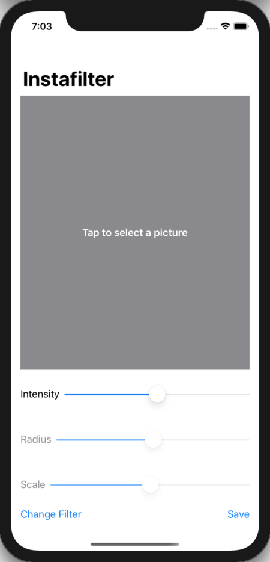
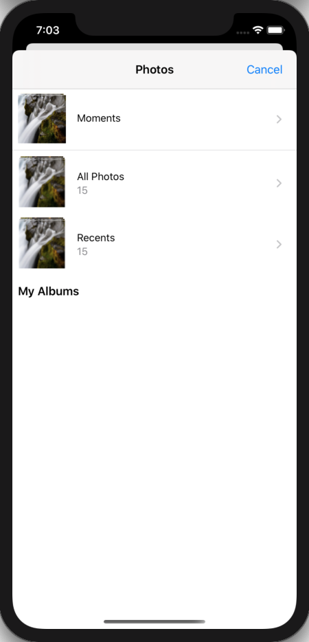
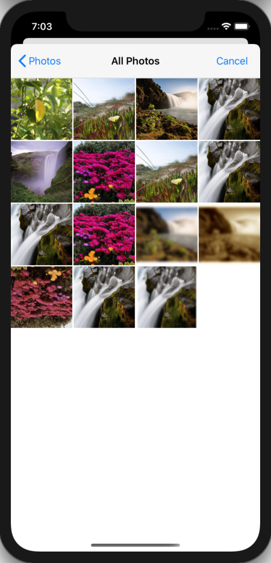
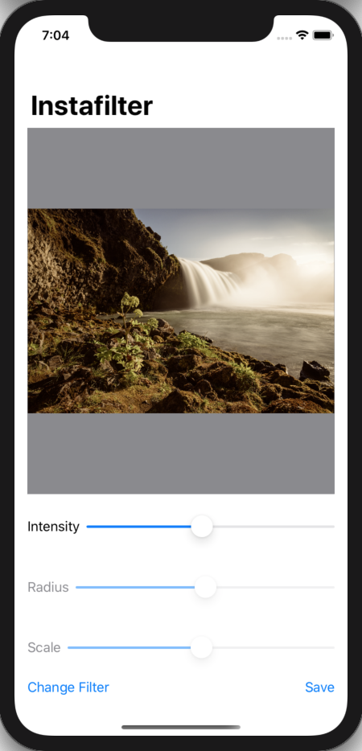
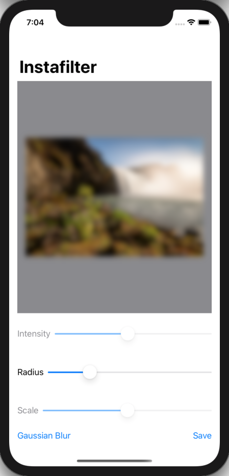
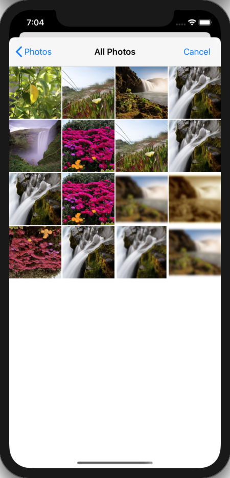
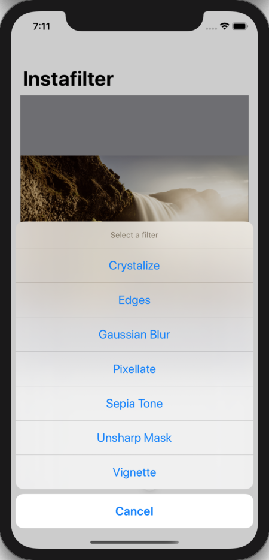
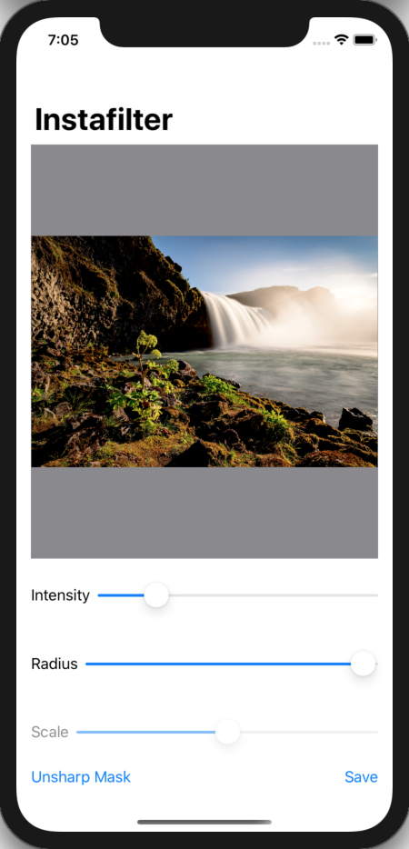

# 100 Days of SwiftUI Project 14

## Instafilter

**App Description:**  App that allows the User to select a photo from their photo Library, apply a filter, and save.

**Swift Features Used:**
Bridging to UIKit with UIViewControllerRepresentable and capturing delegate calls with the coordinator, core image, action sheets, custom bindings, image saving with UIImageWriteToSavedPhotosAlbum, NSObject, @objc, #selector, UIImagePickerController.

**Screenshots:**

